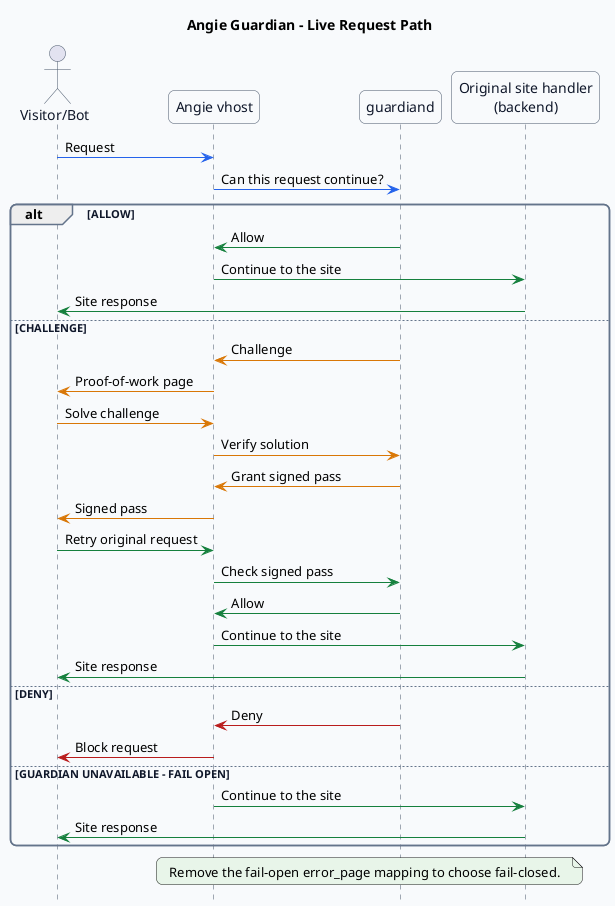
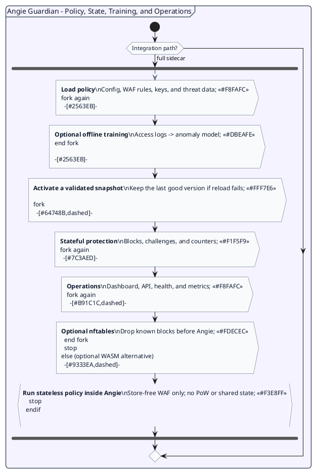

# Angie Guardian: Architecture

How Guardian fits into Angie, and what it does on and off the request path.
For an overview of the project see the [README](README.md); for configuration
and operations see [USAGE.md](USAGE.md) and <https://angieguardian.org/>.

## Live request path

Angie remains in the request path and keeps serving the site's existing static,
`try_files`, FastCGI, or reverse-proxy handler. Guardian is a sidecar decision
service: Angie sends it a bodyless internal authorization subrequest and acts on
the resulting allow, challenge, or deny response.

## Policy, state, training, and operations

The same sidecar loads policy and key material, owns stateful protection, and
exposes a separate operations listener. Offline training and optional
integrations feed this supporting plane without sitting in the live request
path.

