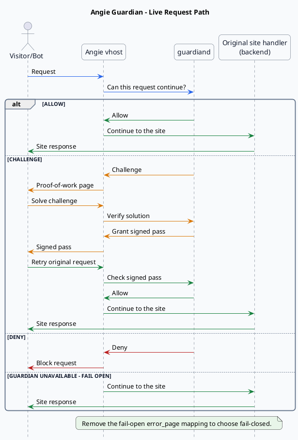
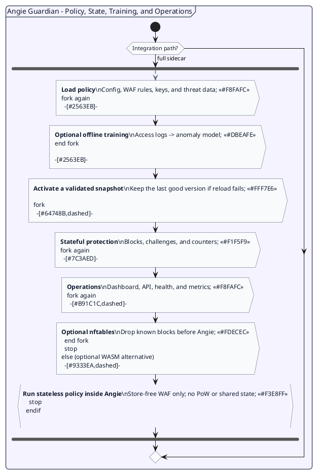

# Angie Guardian

A Web Application Firewall (WAF) and proof-of-work bot firewall for
[Angie](https://angie.software/), written in Go.

Guardian protects Angie-hosted websites and APIs from malicious traffic,
abusive bots, and automated attacks while legitimate visitors can continue to
the site normally. It allows trusted requests, challenges suspicious clients
with proof of work, and blocks clear threats.

## Features

Guardian combines a request-time WAF with proof-of-work challenges. Policy is
configurable per domain, so one instance can protect multiple vhosts.

- **Hot-reloadable WAF:** RE2 keyword and regex rules for paths, queries,
  User-Agents, headers, and HTTP methods.
- **Adaptive bot defence:** behavioural scoring, honeypots, IP blocking,
  GeoIP/reputation checks, and verified-bot DNS validation.
- **Proof-of-work passes:** adaptive SHA-256 browser challenges followed by a
  cheaply validated Ed25519-signed cookie; an optional no-JS fallback is
  available.
- **Replay resistance:** challenges are single-use and bound to the domain and
  client IP.
- **Anomaly detection:** optional offline training from Angie access logs with
  fast scoring in the live request path.
- **Resilient deployment:** persistent keys, shared stores for replicas, safe
  reloads, and fail-open or fail-closed integration.

## Quick start

Install a pinned `linux-amd64` or `linux-arm64` package from the
[releases page](https://gitlab.melroy.org/melroy/angie-guardian/-/releases),
then follow the release-first
[Getting Started guide](https://angieguardian.org/guide/getting-started).
The archive contains the binaries, example configuration, starter WAF rules,
Angie snippets, and systemd unit; operators do not need Go or a repository
checkout.

```sh
# After downloading and extracting a pinned release:
sudo install -Dm755 guardiand /usr/local/bin/guardiand
```

For containers and persistent state, see the
[production Docker guide](https://angieguardian.org/guide/production#docker).

## Documentation

Guides, examples, and the complete configuration and API reference are
published at **<https://angieguardian.org/>**.

## How it works

Angie remains in the request path and keeps serving the site's existing static,
`try_files`, FastCGI, or reverse-proxy handler. Guardian is a sidecar decision
service: Angie sends it a bodyless internal authorization subrequest and acts on
the resulting allow, challenge, or deny response. The first diagram follows that
live request lifecycle; the second separates the supporting policy, state,
training, and operations plane from the hot path.



The same sidecar loads policy and key material, owns stateful protection, and
exposes a separate operations listener. Offline training and optional
integrations feed this supporting plane without sitting in the live request
path.



## Performance

Guardian is built for Angie's authorization hot path. A local loopback test on
an AMD Ryzen Threadripper 7960X with 64 connections produced these throughput
results, measured in requests per second:

| Store backend | Allow requests/s | Returning-client requests/s | Challenges issued/s |
|---|---:|---:|---:|
| In-memory store (ephemeral) | 169,000 | 159,000 | 156,000 |
| Pebble (async, default) | 177,000 | 154,000 | 39,000 |
| Pebble (sync, fully durable) | 172,000 | 155,000 | 25,000 |
| BuntDB (async) | 175,000 | 153,000 | 36,000 |
| Redis/Valkey | 96,000 | 94,000 | 34,000 |

The read path remained above 94,000 requests/s across every backend. Challenge
issuance is write-heavy, which explains the difference between the in-memory
and durable stores. See the
[load-testing guide](https://angieguardian.org/guide/load-testing)
for scenarios, latency percentiles, methodology, and reproduction commands.

## Integration paths

Guardian offers two ways to run, sharing one decision core:

- **Sidecar (default, full-featured).** A Go daemon wired into Angie with
  stock `auth_request` directives. This is the complete implementation:
  proof-of-work and behavioural IP blocking use the shared store it owns;
  anomaly scoring and verified-bot DNS are also sidecar-only. Start here.
- **WASM module (optional, stateless WAF).** The store-free checks (allowlist,
  denylist, honeypot, keyword/regex signatures) compiled to WebAssembly and run
  in-process inside Angie via its WASM support, for operators who prefer that
  integration. It is stateless WAF-only: proof-of-work, behavioural blocking,
  anomaly scoring and verified-bot DNS checks need the sidecar. Build it with `make wasm`; see the
  "WASM module" section of [USAGE.md](USAGE.md).

Both paths share the same store-free matching logic. Their stateful outcomes
differ: in the sidecar, `challenge` can be satisfied by a bound PoW token and
`block`/honeypot hits persist an IP block; the stateless WASM guest returns a
plain deny for any of those matches. A vouched PoW token never exempts a
sidecar client from `deny` or `block` signature checks, so a stolen token can't
ride past the WAF.

## Operations

- **Observability:** Prometheus metrics, health/readiness checks, a bundled
  [Grafana dashboard](deploy/grafana-dashboard.json), and
  [alert rules](deploy/alerts.yaml).
- **Admin API and dashboard:** token-protected block management, recent
  decisions, anomaly/config status, and an optional air-gapped web dashboard.
- **Safe maintenance:** hot reload keeps the last-good configuration active;
  signing keys can be rotated without immediately invalidating existing passes.
- **Flexible state:** `memory`, `pebble`, or `buntdb` for one instance;
  `redis`/`valkey` for shared multi-instance deployments.

See [USAGE.md](USAGE.md) for endpoints, authentication, dashboard setup, reload,
and key-rotation details.

## Security

Guardian's [security model and limitations](https://angieguardian.org/guide/threat-model)
spell out what it defends against and what it deliberately does not. To report a
vulnerability, see [SECURITY.md](SECURITY.md); please do not open a public issue.

## License

[AGPL-3.0](LICENSE), © Melroy van den Berg

---

## Development

Everything below this line is for contributors building, testing, or changing
Angie Guardian. Operators can stop here and use the documentation linked above.

### Testing

The default suite is self-contained; Docker is only needed for end-to-end tests.

| Check | Command | Purpose |
|---|---|---|
| Unit | `go test ./...` | Core, stores, and HTTP transports |
| Race detector | `go test -race ./...` | Concurrency regressions |
| End-to-end | `make e2e` | Real Angie → guardiand → backend stack |
| Fuzz | `make fuzz` | Untrusted and hot-reloaded parsers |
| Benchmarks | `go test -bench=. -benchmem ./core/... ./core/pow/...` | Request hot paths |

The [end-to-end suite](test/e2e/) covers proof-of-work, WAF outcomes,
behavioural blocking, fail-open, metrics, and the Admin API. CI runs it on
`main` and release tags; run it locally before merging stack-level changes.
Commit useful fuzz crashers from `testdata/fuzz/` as regression seeds.

#### Seed the dashboard

Run a throwaway instance and generate representative dashboard traffic from two
shells:

```sh
go run ./cmd/guardiand -config test/seed/guardian.seed.yaml
make seed                  # two minutes
make seed SEEDTIME=5m      # optional longer run
```

Open <http://127.0.0.1:18072/admin/dashboard#token=seed-demo-token>. The linked
[seed configuration](test/seed/guardian.seed.yaml) is memory-only and intended
for local development. `make seed` creates a realistic traffic mix; use
`guardian-loadtest` for throughput measurements.

### Building from source

The required Go toolchain is pinned in [go.mod](go.mod). Build the three sidecar
binaries into `dist/`, or additionally build the optional WASM module:

```sh
make build
make wasm
```

The documentation site can be previewed with `make docs-dev` or built with
`make docs`.

### Performance testing

`guardian-loadtest` drives
the hot path over keepalive HTTP the way Angie does and reports throughput and
latency percentiles.

**Scenarios** (the first three are read-dominated; `challenge` is the one
write-heavy path):

| Scenario | What it does | Store I/O per request |
|---|---|---|
| `allow` | plain request, full pipeline, ends in "default allow" | none on the embedded backends once the block mirror is seeded; 1 read on `redis` (read-through, so another replica's blocks apply immediately) |
| `token` | solve one PoW challenge, then hammer `/auth` with the cookie (the production common path) | same as `allow` |
| `deny` | denylisted client IP (deny + decision logging path) | no store I/O |
| `challenge` | issue a fresh PoW challenge per request | normally 1 **write** (challenge CAS); under [attack mode](https://angieguardian.org/guide/attack-mode), or when that stateful write fails, issuance is stateless: no write at issue, the single-spend write moves to redemption. Rate-limit and escalation counters are counted in-process and flushed in the background either way |

**Results** (single node, loopback, 64 connections, load generator sharing the
same CPU: AMD Ryzen Threadripper 7960X, 24C/48T; Go 1.25; Valkey 9 for the redis
backend; fresh daemon per run). Each cell is **throughput / p50 / p99** (req/s
and per-request latency):

| Backend | allow | token | deny | challenge (write) |
|---|---|---|---|---|
| `memory` (ephemeral)              | 169k / 0.15ms / 1.8ms | 159k / 0.21ms / 1.7ms | 150k / 0.14ms / 2.4ms | **156k / 0.29ms / 1.7ms** |
| `pebble` (async, default durable) | 177k / 0.14ms / 1.7ms | 154k / 0.21ms / 1.8ms | 152k / 0.14ms / 2.4ms | **39k / 0.73ms / 20ms** |
| `pebble` (sync, fully durable)    | 172k / 0.14ms / 1.8ms | 155k / 0.21ms / 1.8ms | 152k / 0.14ms / 2.4ms | **25k / 2.6ms / 7.5ms** |
| `buntdb` (async, single-file)     | 175k / 0.14ms / 1.7ms | 153k / 0.23ms / 1.8ms | 150k / 0.14ms / 2.4ms | **36k / 1.3ms / 17ms** |
| `redis`·`valkey` (fleet)          | 96k / 0.62ms / 1.4ms  | 94k / 0.63ms / 1.4ms  | 162k / 0.13ms / 2.3ms | **34k / 1.2ms / 21ms** |

(`buntdb` + `sync: true` measured only ~0.6k challenge writes/s, because a
single-writer store fsync'ing every commit is that slow, so the combination is
**rejected at startup**; use `pebble` with `sync: true` for synchronous durability.)

Every backend clears the ≥50k req/s budget on the read paths with a wide margin.
On the **embedded** backends the in-process block mirror makes the store
authoritative, so `allow`/`token` do no store I/O at all after the seed scan,
which is why they cluster at ~150–177k. `redis`/`valkey` is the exception: it
stays read-through (one network read per request for cross-replica correctness),
so its `allow`/`token` land lower (~94–96k) while `deny` (no store read) stays fast.

The **write** path is where the backend matters. Issuing a challenge writes one
CAS record, and the durable backends absorb that far better than a synchronous
single-writer store:

- **`pebble`** (default durable) sustains ~39k challenge writes/s in async mode,
  and even in fully-durable `sync: true` mode still does ~25k/s. Both are far above
  a synchronously-fsync'd single-writer store. It is an LSM engine, so writes hit
  the WAL and memtable and are flushed in the background.
- **`buntdb`** matches Pebble in async mode (~36k/s) and stores everything in one
  file, which is simpler to back up. It is single-writer, so `sync: true` would
  fsync every commit and collapse to ~600/s, so guardiand **refuses to start** in
  that configuration and points you to Pebble for synchronous durability.
- **`memory`** has no write ceiling at all (~156k/s) but loses all state on
  restart.
- **`redis`/`valkey`** sustains ~34k challenge writes/s (comparable to the
  embedded durable backends) and is the **multi-instance** option: it is the
  shared store that lets replicas behind a load balancer see each other's blocks
  and single-spend markers. It trades some read throughput for that (one network
  read per request). The embedded backends above are single-node only. See the
  [store guide](https://angieguardian.org/guide/production#choosing-a-store-backend).

Two ways to lift the write path further when a burst of *new* clients could
exceed the durable ceiling:

- Set `pow.mode: suspicion` so there is no catch-all challenge (only explicit
  anomaly/WAF/GeoIP/reputation policies issue one), or rely on
  [attack mode](https://angieguardian.org/guide/attack-mode)'s
  **stateless** issuance, which writes nothing at issue time. The only remaining
  write is then the single-spend marker at redemption, which an attacker cannot
  trigger without actually solving the proof of work.
- Verified tokens are cached in-process (~144 ns vs ~43 µs for a full Ed25519
  verification), so a returning client's request stays on the fast read path
  regardless of backend.
- At these rates the read paths are bound by Go's garbage collector, not the
  store: `GOGC=800` raises allow throughput ~20%. See "GC tuning" in the
  production guide.

The `redis` backend works with both Redis and
[Valkey](https://valkey.io/) (a drop-in replacement, same wire protocol and same
`backend: redis` value).

#### Reproduce

```sh
go build ./cmd/guardiand ./cmd/guardian-loadtest
mkdir -p .guardian
sed -e 's#/etc/guardian/rules.d/common.yaml#deploy/rules-common.yaml#' \
    -e 's#/etc/guardian/#.guardian/#g' \
    -e 's#/var/lib/guardian/#.guardian/#g' \
    guardian.example.yaml > guardian.local.yaml

# 1. Start guardiand with your store backend (pebble shown; for redis set
#    store.backend: redis and store.addr in the config). PoW must be enabled
#    for the token/challenge scenarios.
./guardiand -config guardian.local.yaml &

# 2. Run each scenario (8s, 64 connections). Use a distinct -ip per read run so
#    a behavioural block from one run doesn't bleed into the next; the
#    challenge scenario rotates the client IP itself to dodge the issuance limit.
#    allow uses the PoW-off host: the scenario expects 200s, and a PoW-on host
#    answers 401 (challenge) for unvouched clients.
./guardian-loadtest -scenario allow     -host api.example.com -ip 198.51.100.10 -c 64 -d 8s
./guardian-loadtest -scenario token     -host example.com     -ip 198.51.100.11 -c 64 -d 8s
./guardian-loadtest -scenario deny      -host example.com     -ip 203.0.113.9   -c 64 -d 8s   # IP must be denylisted
./guardian-loadtest -scenario challenge -host example.com                        -c 64 -d 8s
```

Micro-benchmarks for the hot functions (`Evaluate`, PoW verification, anomaly
scoring) live alongside the code: `go test -bench=. -benchmem ./core/... ./core/pow/...`

### Architecture

All decision logic lives behind a single transport-agnostic seam:

```go
core.Engine.Evaluate(ctx, RequestContext) Decision
```

The HTTP `auth_request` transport is a thin wrapper around it. The store-free
WAF checks live in the leaf package `core/stateless`, which the WASM guest
imports directly, so the in-process module reuses the exact same logic without
dragging in the store, PoW or anomaly dependencies.

```
core/            decision engine, pipeline, config
core/stateless/  store-free WAF checks + value types (shared by sidecar & WASM)
core/pow/        challenges, Ed25519 JWTs, token cache, key persistence + rotation
core/waf/        signature rules, signed IDs
core/anomaly/    statistical baseline model, online scorer, hot-swap cache
core/store/      TTL'd shared state: memory | buntdb | pebble | redis
core/metrics/    Prometheus instrumentation (private registry)
transport/http/  auth_request sidecar + admin/metrics
transport/wasm/  optional http-wasm guest (stateless WAF, runs inside Angie)
cmd/             guardiand (sidecar), guardian-train (offline anomaly training),
                 guardian-loadtest (stress tool)
deploy/          Angie snippets, systemd unit, rules, Grafana dashboard, alert rules
web/             challenge/denied pages (self-contained HTML + JS solver)
```
